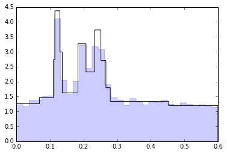

# Bayesian Blocks
## A Python implementation that incorporates multiple independent time series
[](https://zenodo.org/badge/latestdoi/23258/Cadarn/bayesBlocks)


This is a python implementation of:
> Studies in Astronomical Time Series Analysis. VI. Bayesian Block Representations:
> *Jeffrey D. Scargle, Jay P. Norris, Brad Jackson, James Chiang* - 
> [Link](http://arxiv.org/abs/1207.5578)

It is based upon the example MATLAB code and the underlying mathematical description of the algorithm in the paper. The code has been tested in Python 2.7 and 3.5. It is still in development as while the analysis is easy to perform on a single time-series, it is not 'user-friendly' to deploy it on multiple timeseries at this time. 

### Example 1: Built in test using example data
This is test checks everything is running as expected but doesn't expose the specifics of how to run a Bayesian blocks analysis


```python
import BayesBlocks as bb
```


```python
%matplotlib inline
subDF, myBlocks = bb.testBayes()
```

    Input data processed ready for Bayesian Block calculation ...
    Using a FAP of 0.050000 equates to a changepoint prior of 7.443134
    Block fitness function assessed ...
    Changepoints recovered ...
    Post processing complete...
    ==============
    Analysis of input data has found that it is optimally segemented into 14 blocks
    [    0  1751  3001  3247  4577  5013  6565  8172  9393 10813 11635 12114
     16867 20474]




